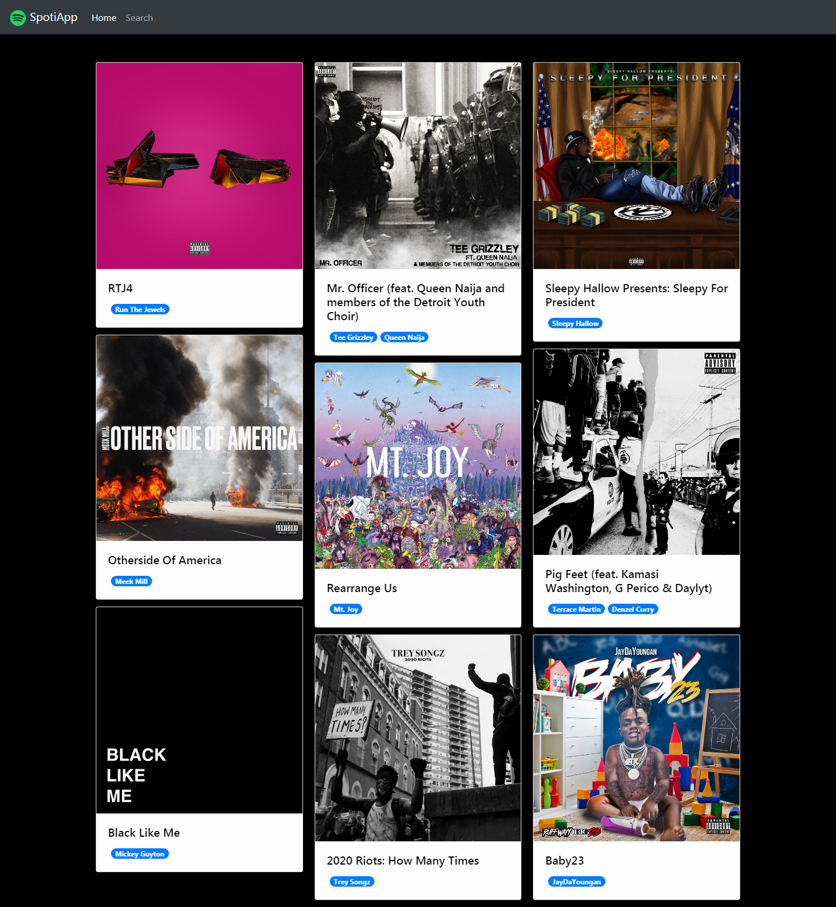
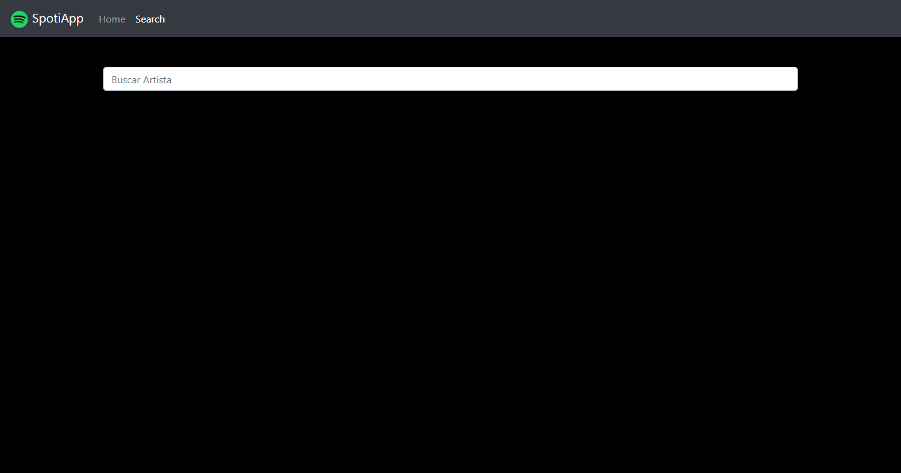
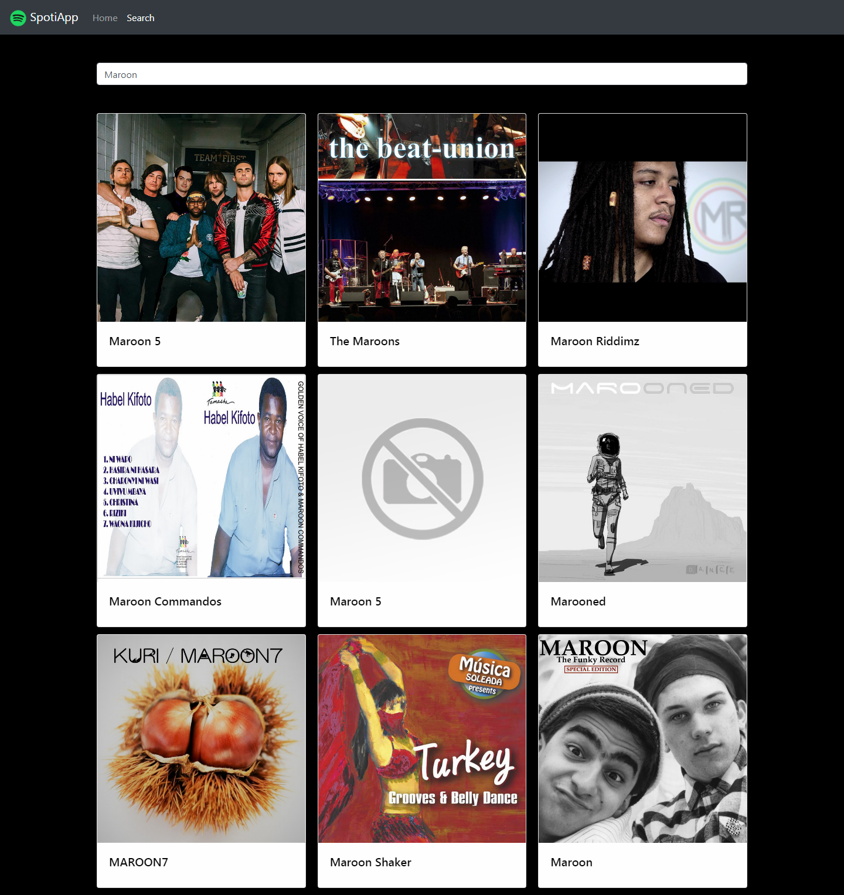
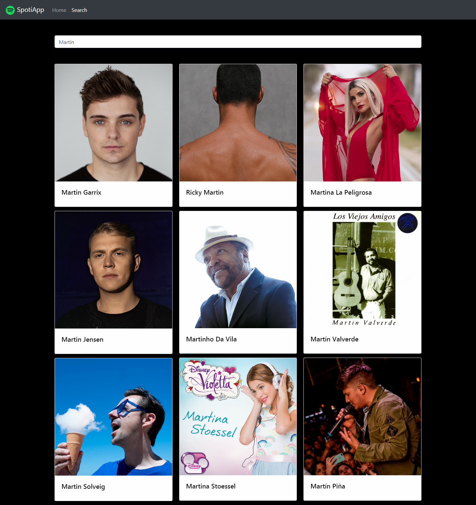
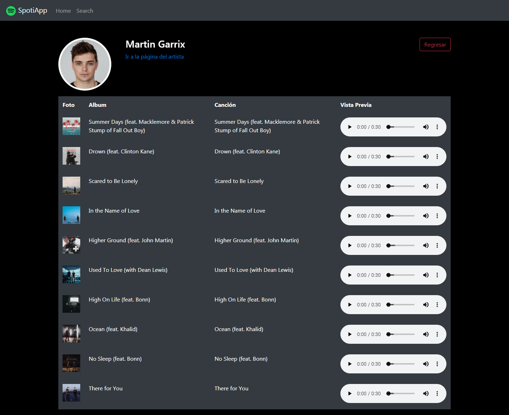

# SpotiappAngular

Proyecto desarrollado con Angular y Bootstrap usando la API de Spotify (haciendo el uso de pipes, servicios, componentes) para la presentación de nuevos lanzamientos, busqueda de artistas y los mejores temas de los artistas.

## Instrucciones:

1. Escribe `ng serve` para levantar un servidor local con Angular.
2. Navega al `http://localhost:4200/`. La aplicacion automáticamente se recargará con los cambios que se hagan.

IMPORTANTE: Para correr la app de manera local es necesario un Token de autenticación proporcionada por Spotify, este token expira cada hora. Más información en https://developer.spotify.com/documentation/general/guides/authorization-guide/

